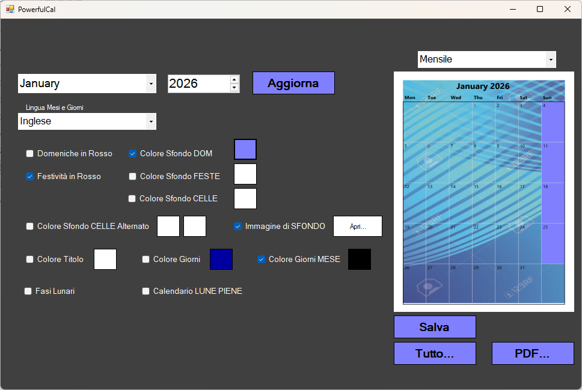
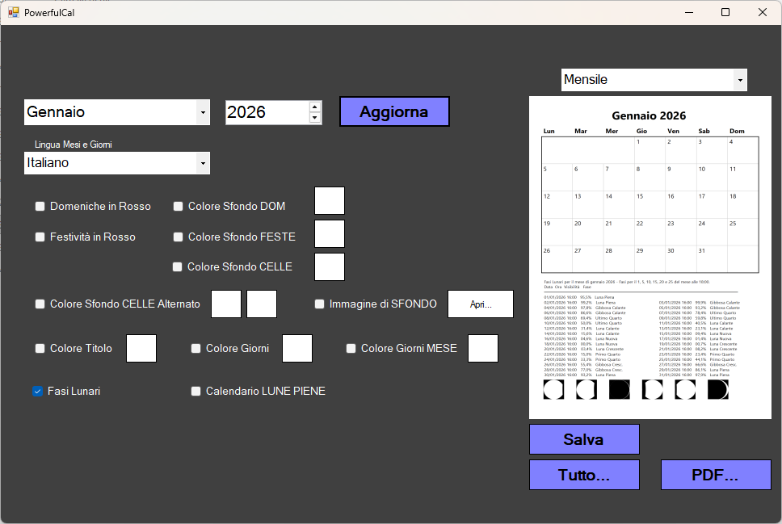

### 📅 PowerFulCal

PowerFulCal è un’applicazione desktop Windows sviluppata in VB.NET (Windows Forms – .NET Framework 4.8.1) per la creazione di calendari mensili e annuali con fasi lunari. Consente di selezionare anno e mese, generare il calendario corrispondente e stampare o salvare i risultati in diversi formati grafici.

✨ Funzionalità principali

📆 Selezione di anno e mese
🌙 Calcolo e visualizzazione delle fasi lunari (Luna Nuova, Primo Quarto, Luna Piena, Ultimo Quarto)
🌕 Calendario aggiuntivo dedicato alle sole Lune Piene
🖨️ Stampa completa di tutti i mesi dell’anno
📄 Esportazione in PDF e TIFF
🖼️ Salvataggio delle singole immagini mensili in Bitmap (BMP)
## 🖥️ Screenshot

**Calendario mensile con fasi lunari**  

**Calendario delle sole Lune Piene**  

🛠️ Tecnologie utilizzate

Linguaggio: VB.NET

Framework: .NET Framework 4.8.1

Applicazione: Windows Forms

Sistema operativo: Windows

IDE consigliato: Visual Studio 2019 / 2022

▶️ Avvio del progetto

Clona il repository: git clone https://github.com/USERNAME/PowerFulCal.git

Apri il file .sln con Visual Studio, Verifica il target .NET Framework 4.8.1 . Compila ed esegui il progetto

📁 Struttura del progetto

PowerFulCal/ → codice sorgente
bin/, obj/ → file generati dalla compilazione
screenshots/ → immagini dell’applicazione
.sln → soluzione Visual Studio
README.md → documentazione

🖨️ Output supportati

PDF → stampa annuale completa
TIFF → stampa ad alta qualità
BMP → immagini mensili singole

🚧 Stato del progetto

🟡 In sviluppo / manutenzione

📌 Note
Il progetto è attualmente privato e destinato a uso personale o sperimentale.
